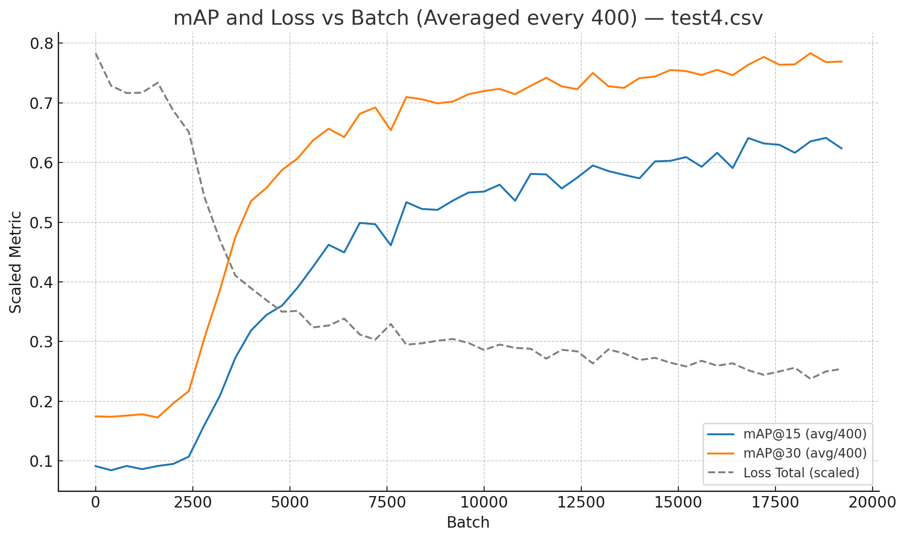
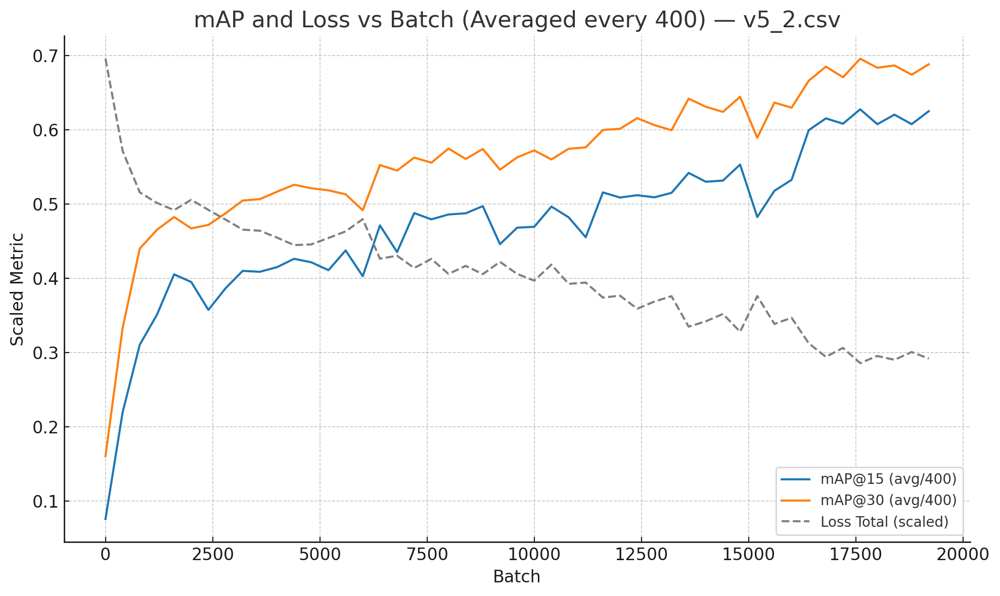

# AutoSpriteTransform
Training and model infrastructure for a super niche model that automatically takes your sprites and rotates and scales them
- Note that the training dataset contains transparent images where RGB values are 0 for all points that have an alpha value of 0. This means that you must add a preprocessing step to emulate this before running inference, else the hidden values behind the transparency, which inevitably are still in the tensor, may screw up the model's predictions.

### Results
#### Results for 1-cosx loss:


#### Results for arctan(x^2) loss:


- These diagrams depicts loss over batch# (taking averages every 400 batches) for 19494 batches over 35 epochs.
- In experiments, as shown, the arctan(x^2) loss function converges slower than the 1-cosx loss function for mAP@30 and 15.
- I'm not sure of the usefulness of the third grey line for decrease in loss over time, as that is more unique to the specific loss function itself rather than actionable results.


## Rotation Prediction: Loss Design and Model Behavior

This model was built to serve a very niche purpose I had: I'm making a Minecraft mod in which you can basically just beg god for whatever items you want, and they'd arrive to your hand like magic complete with custom interactions and textures. Basically, there's a complex backend system that would handle java script code and item logic functionality and then inject them into your game along with custom textures. However, image generation models aren't easily able to generate weapon sprites in specific orientations. In hindsight, I could've fine-tuned Stable Diffusion XL to do this a lot faster but hey, I learned a lot about model architecture, model training and losses, torch implementation and different ML methods.

This document summarizes the challenges encountered and methods explored while training a model to predict rotation angles, particularly in the presence of symmetry and ambiguous cases. The goal was to achieve stable, accurate predictions while avoiding mode-averaging behavior common with standard loss functions.

- Experimentally, scale factor was very fast to converge using simple MSE loss with a simple fully connected head. This document will mostly focus on challenges with rotation.

## Datasets

Generating datasets followed this pipeline:
1. Use an LLM to generate a list of different sci-fi weapons and tools as a csv list
2. Refine this list and for each entry create a unique but guidelined text-to-image prompt
3. For each item, generate 5 examples using a strong Diffusion model
4. Label each item by rotating and scaling them to desired sprite rotation and scale (and reject bad generations) and store these as ground truths in a csv
5. Remove background using a CNN-based model and clean up artifacts (i.e. RGB values hidden behind transparent pixels) for regularity
5. Generate 10 varied examples from each of the generated images by varying color, rotation and scale

Notes:
- I first passed the promptlists through GPT, though it had difficulty not copy-pasting the prompt over and over again, so in tools_2 I switched to Agent mode and forced it to take its time with each generation.
- The Diffusion model used is segmind/SSD-1B and the rmbg CNN model used was briaai/RMBG-2.0
- I initially played around with also adding flip as a sigmoid parameter, and with losses I would input whether it predicted flip correctly and use that to alter the rotation loss function, as well as passing the flip logit into the rotation tensor head input, however after extensive testing it introduced too much complexity with the small parameter count I worked with initially leading to early plateau at poor loss values/mAP. However, with higher model weights now, perhaps I may revisit this.


## Problem

Initial models were trained with standard regression losses such as MSE (Mean Squared Error) but exhibited undesirable behavior. In ambiguous cases due to my application (e.g. for a sword, the general sillhouette is symmetrical and the model could predict between 0° and 180°), the model would consistently predict intermediate angles like 90°, due to how MSE penalizes large deviations more heavily than smaller averaged errors. It would also not be able to learn the difference between handles and blades because any decrease in average loss gradient possibly gained by approaching the learning direction for handles and blades would be met with a much more significant increase in loss gradient by predicting wrong. The slopes just don't match up.

Example:
- `MSE(0°, 90°) = 8100`, `MSE(180°, 90°) = 8100` → average loss = 8100  
- `MSE(0°, 0°) = 0`, `MSE(0°, 180°) = 32400` → average loss = 16200  
Thus, predicting 90° is penalized less than committing to either correct mode.

This led to the model learning to hedge its predictions, especially when the rotation target was bimodal or ambiguous.

## Loss Function Experiments (Results are found above)

### 1. Arctangent-Squared Loss

Implemented the following custom loss:

```python
angle_diff = angle_difference(pred, target)  # wrapped to [-π, π]
loss = torch.mean(torch.atan(angle_diff ** 2))
```

**Properties:**
- Increases with error (e.g., 90°), but gradients flatten for large errors (e.g., 180°).
- Highest slope occurs near 90°, helping the model first learn the general silhouette, then fine-tune distinctions (e.g., handle vs. blade).
- Discourages midpoint averaging in multimodal targets.
- Produces stable convergence in training.

---

### 2. Cosine-Based Loss

Also evaluated:

```python
angle_diff = angle_difference(pred, target)  # wrapped to [-π, π]
loss = torch.mean(-torch.cos(angle_diff) + 1)
```

**Adjustment for Loss Scale:**  
The absolute magnitude of a loss affects its effective learning rate. To compare fairly, I computed the definite integrals within [-π, π]:

- ∫[-π, π] arctan(x²) dx ≈ 6.06291
- ∫[-π, π] (1 − cos x) dx = 2π

By multiplying the cosine-based loss by 6.06291/2π, the average loss magnitude matches that of the arctan-squared loss, reducing effective learning rate discrepancies.

> **Note:** arctan(x²) has no elementary closed-form integral, so the value was computed numerically via Wolfram Alpha.

---

**Additional Notes:**
- The 1 - cos(x) loss also peaks in slope at 90°.
- Since angle error is taken as the minimal signed value, the periodicity of the cosine function does not introduce issues.

### Additional Methods Explored

#### Standard Losses

- **MSE and MAE**: Prone to midpoint averaging and unstable training in ambiguous cases.

#### Distribution-Based Targets

- Attempted encoding the target angle as a soft Gaussian bump over a discretized angle vector (classification-like).
- Required larger models and label smoothing; ultimately abandoned due to added complexity and training cost.
- If I removed the periodicity of error, the model would learn to stay away from these bumps and predict higher angles >360 degrees

### Model Architecture Considerations

- Started with a 5-layer convolutional backbone, 4 of which using `stride=2` downsampling down to [64, 64, 64].
- This showed to be way too small of a model to learn handles and blades, so increased to 6 layers and an output of [256, 1, 1]
- Modified to preserve spatial information by replacing `AdaptiveAvgPool2d((1,1))` with `AdaptiveAvgPool2d((4,4))` (I was dumb and didn't realize this mattered). This helped a lot
- Evaluated head sizes (`512 → 256 → 64 → 1` and smaller variants); larger heads improved performance when data volume permitted.

## Evaluation

Defined a scalar proxy for accuracy: **percentage of predictions within N degrees** of the ground truth (`mAP@N`), implemented using wrapped angle difference and threshold comparison. The specific loss function I used outputted both mAP for 15 degrees and 30 degrees.

## Training

- Initial learning rate is 0.0001 / 1e-4
- Learning rate is auto updated by the torch scheduler using ReduceLROnPlateau: if the average between mAP30 and mAP15 don't improve once within 3 epochs, learning rate is multiplied by 0.5
